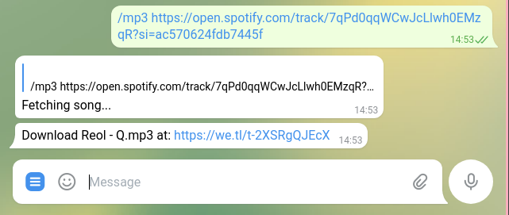

# spotBot #
## Telegram Bot that Download songs from Spotify using spotDL Binary ##

### Bot in action ###

### Features ###

- Download FLAC / MP3 songs / playlist / album from Spotify.

### Setup ###

`
bash setup.sh
`

### Use Bot ###

- Fill in bot token inside bot.py and then:

`
python bot.py
`

and see the magic.

### To-Do ###
- GitHub workflow support (it actually already works but not public yet)
- More features, e.g. song searching (wip)

### Credits and thanks ###
- [spotDL](https://github.com/spotdl) for their work
- [pyTelegramBotAPI](https://github.com/eternnoir/pyTelegramBotAPI) for API used in this bot
- You